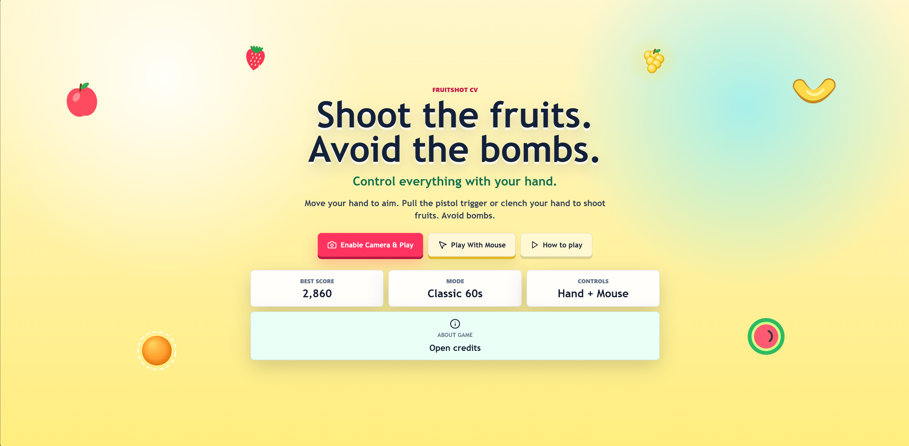
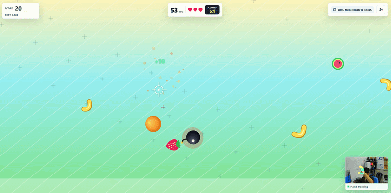

# FruitShot CV

<p align="center">
  <strong>Shoot the fruits. Avoid the bombs. Control everything with your hand.</strong>
</p>

<p align="center">
  A colorful browser arcade game powered by real-time hand tracking, HTML Canvas, React, TypeScript, and MediaPipe.
</p>

<p align="center">
  <a href="https://fruitshot-cv.vercel.app/"><strong>Play the Live Demo</strong></a>
</p>

<p align="center">
  <a href="https://fruitshot-cv.vercel.app/">
    
  </a>
</p>

<p align="center">
  <a href="https://fruitshot-cv.vercel.app/">
    
  </a>
  
  
  
  
</p>

## Play Now

```text
https://fruitshot-cv.vercel.app/
```

Open the game, allow camera access, move your hand to aim, clench your fist or pull the pistol trigger to shoot, and try to survive the 60-second classic mode.

> Webcam access requires `localhost` or HTTPS. The Vercel demo uses HTTPS, so camera permissions work in supported browsers.

## Why This Is Cool

FruitShot CV is not just a Canvas shooter. It turns your webcam into a controller and runs the entire computer vision pipeline directly inside the browser.

- No backend.
- No Python.
- No paid APIs.
- No copyrighted image assets.
- No server-side computer vision.
- Everything runs client-side with JavaScript and WebAssembly.

## Gameplay Preview

<p align="center">
  
</p>

The preview shows the actual Canvas game loop, fruit rendering, bomb hazards, webcam preview, and real-time hand landmark overlay.

## Features

- Real-time hand tracking with MediaPipe Tasks Vision Hand Landmarker.
- Stable palm/knuckle-center aiming for smoother gameplay.
- Fist shooting and pistol-trigger shooting.
- Mouse movement, mouse click, and Space fallback controls.
- Cute arcade Canvas visuals with generated fruit, bombs, particles, explosions, score popups, and combo banners.
- Classic Mode with 60-second timer, 3 hearts, increasing difficulty, and bomb hazards.
- Local high score and local leaderboard.
- Leaderboard sectors for fair scoring:
  - Hand Gesture
  - Mouse
- Generated Web Audio sound effects and arcade-style background music.
- Polished home screen, How To Play visual demo, About Game modal, share score button, and Vercel-ready deployment.

## Gameplay

| Event | Result |
|---|---:|
| Normal fruit | `+10` |
| Rare fruit | `+25` |
| Golden fruit | `+50` |
| Every 5 fruit hits | Combo multiplier increases |
| Bomb hit | `-30`, `-1 heart`, combo reset |
| Miss | Combo reset |
| Timer reaches 0 | Game over |
| Hearts reach 0 | Game over |

The game becomes harder over time:

- Fruit speed increases.
- Spawn rate increases.
- Bomb chance increases slightly.
- Golden fruit stays rare and valuable.

## Gesture Mapping

| Input | Action |
|---|---|
| Palm / knuckle-center movement | Move crosshair |
| Pistol hand pose | Ready shooting state |
| Thumb trigger gesture | Shoot |
| Clenched fist | Shoot |
| No hand detected | Show camera warning |
| Mouse movement | Aim fallback |
| Mouse click / Space | Shoot fallback |

## Computer Vision Pipeline

1. Browser asks for webcam permission through `navigator.mediaDevices.getUserMedia`.
2. Webcam stream is attached to a preview video element.
3. MediaPipe Tasks Vision loads the Hand Landmarker model.
4. The game loop calls `detectForVideo` in `VIDEO` running mode.
5. MediaPipe returns 21 normalized hand landmarks.
6. Gesture logic detects fist, pistol pose, trigger state, and confidence.
7. A stable knuckle-center anchor maps webcam coordinates to Canvas coordinates.
8. The x-axis is mirrored so hand movement feels natural.
9. Crosshair movement is smoothed with interpolation.
10. Shooting checks crosshair overlap against fruit and bomb hitboxes.

## Architecture

```text
Webcam -> MediaPipe Hand Landmarker -> Gesture Detector
       -> Smoothed Aim Point -> Canvas Game Engine
       -> Collision / Scoring / Particles / Audio / HUD
```

The computer vision layer is separated from the game layer:

- `src/cv/` handles landmarks, hand tracking, and gesture rules.
- `src/game/` handles entities, collision, scoring, difficulty, particles, audio, and rendering.
- `src/components/` handles React screens and UI.
- `src/hooks/` contains reusable browser hooks.

## Tech Stack

| Area | Tech |
|---|---|
| App | React + Vite |
| Language | TypeScript |
| Rendering | HTML Canvas |
| Computer Vision | MediaPipe Tasks Vision Hand Landmarker |
| Camera | Browser Webcam API |
| Audio | Web Audio API |
| Persistence | Local Storage |
| Hosting | Vercel |

## Project Structure

```text
fruitshot-cv/
  index.html
  package.json
  package-lock.json
  vite.config.ts
  tsconfig.json
  vercel.json
  README.md
  LICENSE
  src/
    App.tsx
    main.tsx
    styles/
      global.css
    components/
      AboutGame.tsx
      GameCanvas.tsx
      GameOverScreen.tsx
      HomeFruitCanvas.tsx
      HowToPlay.tsx
      HUD.tsx
      StartScreen.tsx
      WebcamView.tsx
    cv/
      gestureDetector.ts
      handTracker.ts
      landmarkUtils.ts
    game/
      audio.ts
      collision.ts
      constants.ts
      difficulty.ts
      engine.ts
      entities.ts
      leaderboard.ts
      particles.ts
      scoring.ts
      spawner.ts
      types.ts
    hooks/
      useAnimationFrame.ts
      useLocalStorage.ts
      useWebcam.ts
    utils/
      clamp.ts
      math.ts
```

## Local Development

Install dependencies:

```powershell
npm install
```

Run the development server:

```powershell
npm run dev
```

Open:

```text
http://localhost:5173
```

Build for production:

```powershell
npm run build
```

Preview the production build:

```powershell
npm run preview
```

## Deploy To Vercel

This project is already configured for Vercel.

```text
Framework Preset: Vite
Build Command: npm run build
Output Directory: dist
Install Command: npm install
```

No environment variables are required.

## GitHub Pages

GitHub Pages can also host the static build. If deploying under a repository subpath, build with:

```powershell
npm run build -- --base=/fruitshot-cv/
```

Then publish the `dist` folder with your preferred Pages workflow.

## Current Limitations

- Leaderboard is local to each browser/device using `localStorage`.
- A global online leaderboard would require a database or serverless storage such as Supabase, Firebase, or Vercel KV.
- Gesture feel can vary by lighting, camera quality, and hand distance.
- The MediaPipe model currently loads from public CDN/model URLs.

## Roadmap

- Global leaderboard.
- Calibration screen for hand size and camera position.
- Survival mode.
- Zen mode.
- Daily challenge seed.
- More fruit types and power-ups.
- Mobile landscape tuning.
- Offline-hosted MediaPipe model assets.
- More gameplay GIFs for gesture calibration and leaderboard flow.

## License

MIT. All fruit, bomb, UI, and gameplay visuals are generated with Canvas or CSS. No copyrighted image assets are included.
